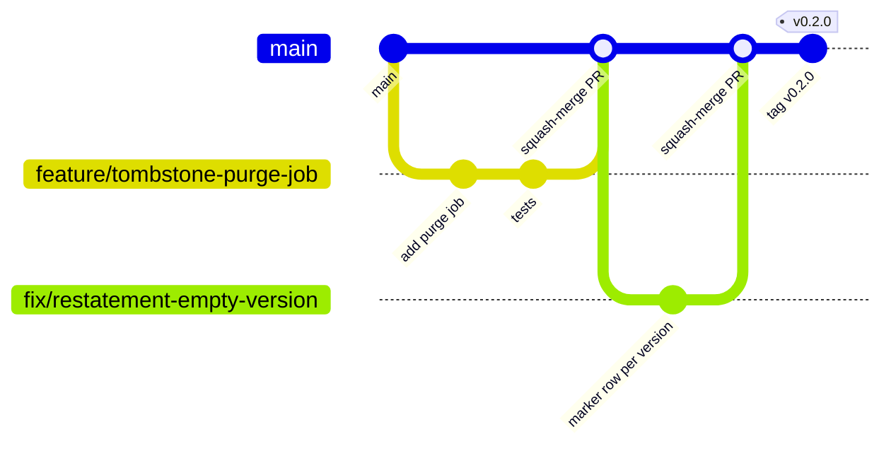

# Contributing

Thanks for helping build the consumer data platform. This guide covers how we branch, commit and review, and what has to pass before a change merges.

## Branching model

We use **trunk-based development with short-lived branches**:

- `main` is the trunk. It is always releasable and **protected**: no direct pushes, merges only through a pull request with green CI and one approving review. A local pre-commit hook (`no-commit-to-branch`) also refuses commits made on `main`.
- Work happens on a short-lived branch cut from the latest `main`, ideally merged within a few days. Rebase on `main` rather than merging `main` into your branch.
- Branch names use a type prefix and a short kebab-case description:

  | Prefix | For | Example |
  |---|---|---|
  | `feature/` | New behaviour | `feature/tombstone-purge-job` |
  | `fix/` | Bug fixes | `fix/restatement-empty-version` |
  | `docs/` | Documentation and ADRs only | `docs/adr-0019-online-features` |
  | `chore/` | Tooling, CI, dependency bumps | `chore/bump-iceberg-1-12` |
  | `refactor/` | Behaviour-preserving code changes | `refactor/split-publish-gate` |

- There are no long-lived `develop` or `release` branches. Releases are tags on `main` (`vMAJOR.MINOR.PATCH`).



## Commit messages

Follow [Conventional Commits](https://www.conventionalcommits.org/):

```
feat(file-ingest): add marker row per delivery version

Closes the empty-newest-version gap described in ADR 0013.
```

Common types are `feat`, `fix`, `docs`, `test`, `refactor`, `chore` and `ci`. Scopes match modules or areas: `cdc-merge`, `file-ingest`, `publish-gate`, `ci`, `adr`. Pull requests are **squash-merged**, so the PR title must itself be a valid conventional commit.

## Local setup

```sh
make setup    # .venv on Python 3.14, dev tools, Iceberg runtime jar
make hooks    # install git hooks (pre-commit and pre-push)
make check    # lint + security + tests, i.e. what CI runs apart from Docker and CodeQL
```

You need Python 3.14 and JDK 21 (see the README for installing them locally without admin rights), or run everything in Docker with `make docker-test`.

## Git hooks

Installed by `make hooks` from `.pre-commit-config.yaml`:

| Stage | Hooks | Time |
|---|---|---|
| **commit** | trailing whitespace, end of file, YAML/TOML checks, merge markers, large files, private keys, no commits to `main`, ruff lint and format, actionlint, gitleaks | seconds |
| **push** | bandit, the full pytest suite against a real local Iceberg catalog | ~40 s |

CI runs the same commit-stage hooks, so local and CI checks cannot drift. Do not bypass hooks with `--no-verify`. If a hook is wrong, fix the hook in a PR.

## Pull requests

A PR is ready for review when:

- [ ] CI is green: lint, tests (Python 3.12 and 3.14), security (bandit, pip-audit), Docker build plus tests in the image, and CodeQL.
- [ ] **New behaviour comes with a test that fails without it.** For changes to one of the three guarantees (CDC merge, file restatement, publish gate), break the mechanism locally and confirm a test fails, as recorded in `docs/test-plan.md`.
- [ ] `docs/design.md` and `docs/test-plan.md` are updated if behaviour or guarantees changed.
- [ ] An ADR is added if an architectural decision changed (see below).
- [ ] Money stays signed integer paise. No floats, no `DECIMAL` rupees in pipelines.
- [ ] The description says what changed, why, and how it was verified.

Keep PRs small: one concern each, and ideally under about 400 changed lines excluding tests.

## Architecture decisions

Architecture decisions live in [`docs/adr/`](docs/adr/README.md). Add a new ADR when you:

- introduce, replace or drop a component or tool;
- change a guarantee or its mechanism (for example how the CDC merge orders changes);
- change a cross-cutting rule (money representation, retention, access, supported versions).

Copy `docs/adr/0000-template.md` to the next free number, set it to `Proposed` in your PR, and to `Accepted` when the PR merges. Never rewrite an accepted ADR. Supersede it with a new one and update the old one's status line.

## Dependency and version updates

Dependabot opens weekly PRs for pip packages, GitHub Actions and Docker base images. Actions are pinned to commit SHAs with the version in a comment. Two updates are deliberately manual, and each needs an ADR update:

- **PySpark minor/major:** must move together with the Iceberg Spark runtime (`iceberg-spark-runtime-<spark>_2.13`) in `Makefile`, `Dockerfile`, `tests/conftest.py` and CI.
- **JDK major:** must stay within Spark's supported Java versions (17/21 for Spark 4.1).

## Reporting security issues

Do not open public issues for vulnerabilities. Use GitHub's private vulnerability reporting (the **Security → Report a vulnerability** tab) instead.
