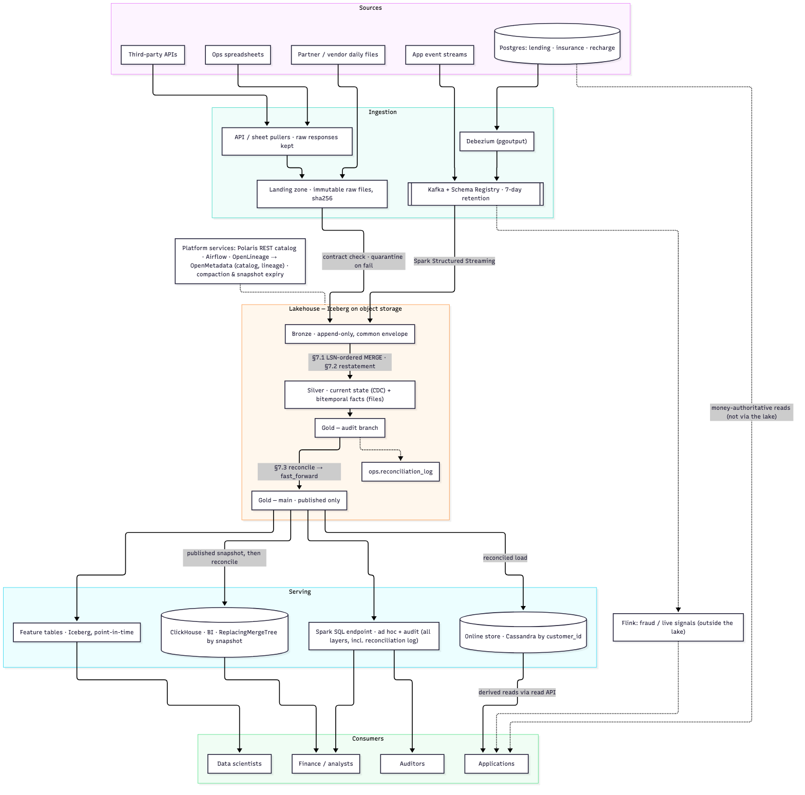

# Consumer Data Platform: Lakehouse

[](https://github.com/dataguykapil/consumer-biz-data-platform/actions/workflows/ci.yml)
[](https://github.com/dataguykapil/consumer-biz-data-platform/actions/workflows/codeql.yml)


A lakehouse design for three consumer businesses (**lending, insurance and recharge**), with working code for the three places where a plausible design gives wrong money numbers without any error.

- **Scale it's designed for:** ~10k events/s at peak, ~500M file rows/day, 50M customers, 5 years of history.
- **Money:** signed integer paise throughout.

## Contents

- [Architecture](#architecture)
- [The three hard problems](#the-three-hard-problems)
- [Tech stack](#tech-stack)
- [Repository layout](#repository-layout)
- [Getting started](#getting-started)
- [Development workflow](#development-workflow)
- [Continuous integration](#continuous-integration)
- [Testing approach](#testing-approach)
- [Documentation](#documentation)
- [Known limitations](#known-limitations)
- [Contributing and security](#contributing-and-security)

## Architecture



*The source is the Mermaid diagram in [`docs/design.md`](docs/design.md#3-architecture). Regenerate the PNG with `make diagram`.*

- **Ingestion:** every source enters through one door. Database changes go through Debezium and Kafka. Files, API responses and spreadsheets go through a landing zone that stores them exactly as received.
- **Bronze:** everything lands in an append-only layer where every row carries the same tracking columns.
- **Silver:** holds current-state tables built from CDC, and bitemporal fact tables built from files.
- **Gold:** published only after its control totals match the source **to the paise**.
- **Serving:** ClickHouse for dashboards (BI only), an online store (Cassandra, keyed by customer) for derived app reads, and Spark SQL for ad hoc and audit queries. Money that a customer sees is always read from the owning service, never from the lake.

The full design, with trade-offs, sizing, operations and an honesty section, is in [`docs/design.md`](docs/design.md). The individual decisions are in the [ADRs](docs/adr/README.md).

## The three hard problems

| Problem | Guarantee | Code | ADR |
|---|---|---|---|
| **CDC into silver** | However changes arrive (late, twice, out of order), silver ends up exactly like the source. Deletes never come back. | [`cdc_merge.py`](src/cdp/cdc_merge.py) | [0012](docs/adr/0012-lsn-ordered-cdc-merge.md) |
| **Partner files** | Retries, crashes, racing workers and corrected resends never double-count. Any past date can be reproduced "as known then". | [`file_ingest.py`](src/cdp/file_ingest.py) | [0013](docs/adr/0013-file-restatement-single-merge.md) |
| **Publish gate** | Nobody, including the ClickHouse copy, sees a gold number that doesn't match the source exactly. | [`publish_gate.py`](src/cdp/publish_gate.py) | [0014](docs/adr/0014-write-audit-publish-gate.md) |

## Tech stack

| Layer | Choice | Version |
|---|---|---|
| Table format | Apache Iceberg | 1.11.0 (`iceberg-spark-runtime-4.1_2.13`) |
| Catalog | Apache Polaris (Iceberg REST) | — (design) |
| Processing | Apache Spark / PySpark | 4.1.3 |
| Runtime | Python / JDK (Temurin) | 3.14 (3.12 also tested) / 21 LTS |
| Ingestion | Debezium, Kafka, Schema Registry | — (design) |
| Serving | ClickHouse (BI); Cassandra online store (app reads); Spark SQL (ad hoc and audit) | — (design) |
| Catalog, lineage, quality | OpenMetadata, OpenLineage, Soda Core + in-house money checks | — (design) |
| Orchestration | Airflow | — (design) |

Versions are the newest ones that work together; [ADR 0016](docs/adr/0016-toolchain-versions.md) explains why. JDK 25 is outside Spark 4.1's supported set, and PySpark 4.2 has no Iceberg runtime yet. Components marked *design* are specified in the design document but not deployed by this repository.

## Repository layout

```
.
├── src/cdp/
│   ├── cdc_merge.py        # LSN-ordered, idempotent CDC merge with tombstones
│   ├── file_ingest.py      # validation, restatement in one MERGE, bitemporal as-of
│   └── publish_gate.py     # write-audit-publish on Iceberg branches + ClickHouse reconciliation
├── tests/                  # pytest against a real local Iceberg catalog (no mocks)
├── docs/
│   ├── design.md           # the design document
│   ├── test-plan.md        # what each test asserts and which broken design it catches
│   ├── architecture.png    # rendered diagram
│   └── adr/                # architecture decision records
├── .github/                # CI, CodeQL and Dependabot
├── .pre-commit-config.yaml # git hooks: commit stage + push stage
├── Dockerfile              # reproducible test runner
├── Makefile                # setup, lint, security, test, docker, diagram
└── pyproject.toml          # package, pinned dev tools, ruff and bandit config
```

## Getting started

### Quick start with Docker

Requires Docker only.

```sh
make docker-test        # builds Python 3.14 + JDK 21 image and runs the 33 tests inside it
```

### Local setup

**Prerequisites:** Python 3.14 (3.10+ works), JDK 21, `make` and `curl`.

If you don't have them, you can install both into the git-ignored `.tools/` folder without admin rights. The Makefile picks them up automatically. On macOS/arm64:

```sh
# JDK 21 (Temurin)
mkdir -p .tools/jdk21
curl -sSL "https://api.adoptium.net/v3/binary/latest/21/ga/mac/aarch64/jdk/hotspot/normal/eclipse" \
  | tar -xz -C .tools/jdk21 --strip-components=1

# Python 3.14 (via uv)
python3 -m venv .tools/uvenv && .tools/uvenv/bin/pip install uv
UV_PYTHON_INSTALL_DIR=$PWD/.tools/python .tools/uvenv/bin/uv python install 3.14
```

On Linux, use `linux/x64` (or `linux/aarch64`) in the Adoptium URL. The Makefile finds either layout.

Then:

```sh
make setup      # creates .venv, installs dev tools, downloads the Iceberg runtime jar
make hooks      # installs the git hooks
make check      # lint + security + the full test suite
```

### Make targets

| Target | What it does |
|---|---|
| `make setup` | Create `.venv`, install the package with dev tools, fetch the Iceberg jar |
| `make test` | Run pytest (`ARGS="-k cdc -x"` passes options through) |
| `make lint` / `make format` | Check or apply ruff lint and formatting |
| `make security` | bandit (static analysis) and pip-audit (known CVEs) |
| `make check` | lint + security + test |
| `make hooks` | Install the pre-commit and pre-push git hooks |
| `make docker-test` | Build the image and run the suite inside it |
| `make diagram` | Re-render `docs/architecture.png` from the Mermaid source (needs Node and Mermaid CLI in `.tools/`) |

## Development workflow

- **Branching:** trunk-based, with short-lived `feature/`, `fix/`, `docs/`, `chore/` and `refactor/` branches, squash-merged into a protected `main` through pull requests. Details are in [CONTRIBUTING.md](CONTRIBUTING.md).
- **On commit:** hooks run ruff lint and format, actionlint, gitleaks secret scanning, file hygiene checks, and a block on commits to `main`.
- **On push:** hooks run bandit and the full test suite (about 40 seconds).
- **Commit style:** commits follow Conventional Commits.

## Continuous integration

GitHub Actions ([`.github/workflows`](.github/workflows)) runs on every pull request and every push to `main`. All actions are pinned to commit SHAs.

| Job | Checks |
|---|---|
| **Lint** | All commit-stage pre-commit hooks: ruff, actionlint, gitleaks, hygiene |
| **Tests** | pytest on Python 3.12 and 3.14 with JDK 21, against a real Iceberg catalog |
| **Security** | bandit (static analysis) and pip-audit (dependency CVEs) |
| **Docker** | hadolint, image build, and the test suite run inside the image |
| **CodeQL** | Security-extended queries for Python and for the workflows themselves. Runs on PRs, on pushes to `main`, and weekly. |

Dependabot proposes weekly updates for pip packages, actions and base images. PySpark minor versions and JDK major versions are excluded, because they must move in step with Iceberg and Spark.

## Testing approach

The guarantees depend on Iceberg's real `MERGE`, snapshot, branch and commit-conflict behaviour, so the tests run against a real local Iceberg catalog with no mocks. There are 20 tests for the CDC merge and 12 for file ingestion.

To prove the tests catch what they claim, each mechanism was also **broken on purpose**, and at least one test failed every time. That process found real bugs, which are listed in [`docs/test-plan.md`](docs/test-plan.md) and in the design's honesty section.

## Documentation

| Document | What's in it |
|---|---|
| [`docs/design.md`](docs/design.md) | Architecture, ingestion, trust, serving, operations, the three hard parts, and the honesty section, plus appendices on source handling, failure recovery, and observability and governance |
| [`docs/test-plan.md`](docs/test-plan.md) | Each test, what it asserts, and which broken design it would catch |
| [`docs/adr/`](docs/adr/README.md) | 25 architecture decision records: stack, the three guarantees, serving, compression, partitioning and sharding, archival, data quality, catalog and lineage, PII |
| [`CONTRIBUTING.md`](CONTRIBUTING.md) | Branching, commits, hooks, PR checklist, ADR process |

## Known limitations

This is a design with working code for its hardest parts, not a deployed platform. The main gaps, all stated in the design's honesty section:

- **ClickHouse:** the reconciliation SQL hasn't run against a real ClickHouse; only a fake client exercised it.
- **No end-to-end CDC run:** the design hasn't been run with real Debezium and Postgres.
- **No load test:** there has been no load test at 10k events/s.
- **Designed but not coded:**
  - the tombstone purge job
  - merge rules for sources without an LSN
  - a marker row per file version

## Contributing and security

Read [CONTRIBUTING.md](CONTRIBUTING.md) before opening a pull request. Report vulnerabilities privately through GitHub's **Security → Report a vulnerability**, not in a public issue.

**License:** none has been chosen yet. Until one is added, all rights are reserved by the author.
