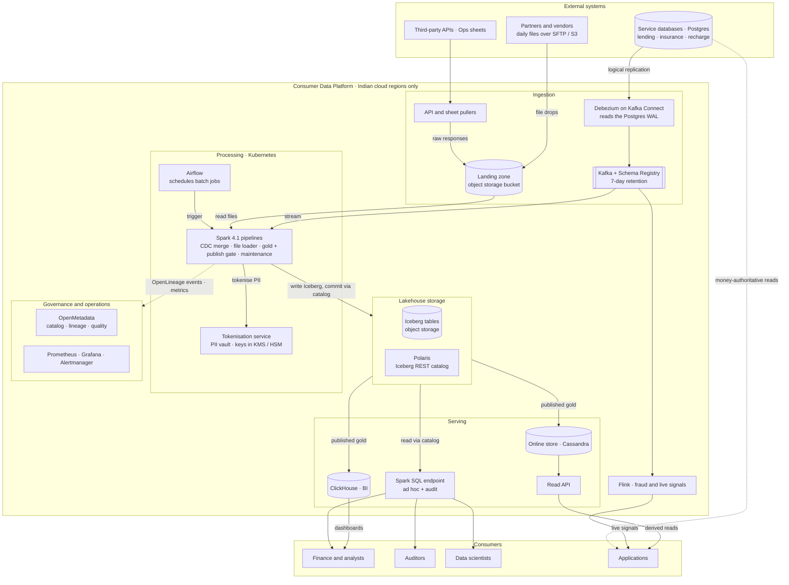
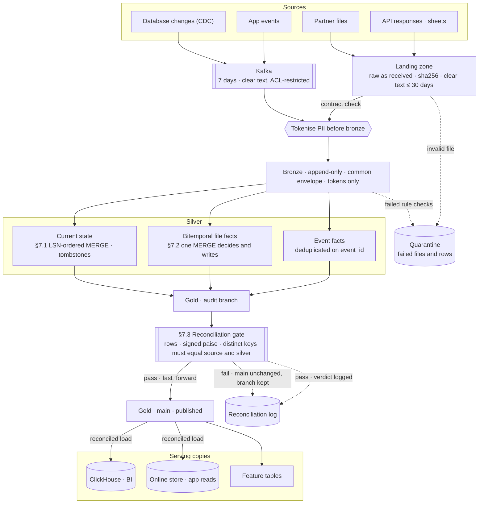

# Consumer Data Platform — Lakehouse Design

**Scope:** lending, insurance and recharge on one lakehouse. **Stack:** Iceberg + Polaris (REST catalog), Debezium + Kafka, Spark 4.1 (PySpark), ClickHouse (BI), Cassandra (app reads). **Code:** `src/cdp/` (371 executable lines), 33 tests (`make test`), [`test-plan.md`](test-plan.md).

## 1. Summary

Every source lands in an append-only **bronze** layer under one common envelope. From there the platform builds trusted **silver** entity and fact tables, and publishes **gold** marts only after they reconcile to the paise. Each consumer gets the engine that fits its access pattern. Apps never read money they show a customer from the lake.

Most of this is a standard lakehouse. The effort goes into three places where a plausible design gives wrong numbers without any error. Each has working code and tests:

1. **CDC into silver (§7.1).** Current-state tables must equal the source under redelivery, reordering and deletes. Where a source gives no usable ordering, the guarantee is weakened explicitly.
2. **Partner files (§7.2).** Retries, crashes, racing workers and corrected resends must never double-count. Five years of history must stay queryable as it was known at any past time. A file fingerprint alone double-counts corrections. Iceberg time travel can't provide the history, because snapshots must be expired.
3. **Publish gate (§7.3).** Nothing reaches a consumer, including the ClickHouse copy, until its control totals match the source exactly.

**What the stack buys us:**
- **One table format that every engine reads and writes:** Spark, ClickHouse, and Trino later if needed.
- **Iceberg branches and tags,** which make publishing only after an audit a metadata operation.
- **A single processing engine for batch and streaming,** so there is only one codebase that produces silver.
- **No vendor lock-in.**

**The price is operations:** we run the catalog, Kafka, Spark on Kubernetes, ClickHouse and Cassandra ourselves (§8).

## 2. Assumptions

| Area | Assumption |
|---|---|
| Sources | PostgreSQL per service, with logical replication and a primary key on every table. |
| Money | `BIGINT` paise end to end, **signed** (refunds and reversals are negative). No floats or `DECIMAL`. Spark runs with ANSI mode on (the Spark 4 default, checked locally), so an overflowing sum fails instead of wrapping. |
| Volume | Peak 10k events/s (≈3k/s on average, about 260M/day), plus 500M file rows/day, so ≈0.8B rows/day into bronze. 50M customers. |
| Partner files | One **full** file per (partner, business date). A resend replaces the earlier file and is never a delta. The trailer carries row count, paise total, distinct keys and `generated_at`, which orders versions. |
| Control totals | Each service can report per-day totals (count, paise, distinct keys) once the day is closed. Without them there is nothing independent to reconcile against. |
| Freshness | The lake is minutes-fresh at best. Anything sub-second (fraud, live balances) is served from the source or from Flink on Kafka. |
| Identity | Each business keys its own `customer_id`. Resolving one person across businesses is out of scope (§9). |
| Retention | Five years for bronze, silver, gold and raw landed files. Kafka keeps 7 days. |

## 3. Architecture

Two views: **containers** (what runs and who talks to whom) and **data flow** (the path a record takes, and where each guarantee applies).

### 3.1 Containers

*Rendered copy: [`architecture-containers.png`](architecture-containers.png). Regenerate both diagrams with `make diagram`.*

Read it top to bottom: external systems feed ingestion; Spark pipelines tokenise PII and write Iceberg through the Polaris catalog; published gold feeds three serving paths. Apps never read the lake for money: that path is the dotted line from the service databases.

### 3.2 Data flow

*Rendered copy: [`architecture-dataflow.png`](architecture-dataflow.png).*

Clear-text PII exists only in Kafka and the landing zone; everything from bronze onwards holds tokens. Each silver merge and the gate are the three hard parts (§7). Nothing reaches a serving copy without passing the gate.

| Layer | Holds | Write pattern |
|---|---|---|
| **Landing** | Files, API responses and sheet exports exactly as received, addressed by sha256 | Write-once |
| **Bronze** | Every record in the common envelope (§4), PII already tokenised (§8). CDC keeps *every* change, not just the latest state. This is the replay point, since Kafka keeps only 7 days and partners can't resend old data. | Append-only |
| **Silver** | *Current-state entities* from CDC (§7.1) and *bitemporal facts* from files and events (§7.2) | `MERGE`, merge-on-read |
| **Gold** | Domain marts, finance ledgers and feature tables. Each metric is defined once, in code. | Write-audit-publish (§7.3) |

### 3.3 Choices, what they cost, and what I rejected

| Decision | Chosen | Rejected, and why | What it costs |
|---|---|---|---|
| Table format | **Iceberg** | Delta (narrower multi-engine support, and branches are what the gate needs); Hudi (heavy to operate) | We own compaction, snapshot expiry and delete-file cleanup |
| Catalog | **Polaris** (REST) | Hive Metastore (no REST spec or credential vending); Glue and Unity (lock-in) | Another service to run. It is a single point of failure for *commits*. |
| Processing | **Spark**, batch and micro-batch | Flink-only (weaker Iceberg upsert and maintenance tooling, and a second codebase for files); lambda (two pipelines that eventually disagree) | Lake freshness bottoms out at 1–5 minutes. Flink stays outside the lake. |
| BI serving | **ClickHouse** (BI only), loaded from published gold | Querying Iceberg directly for dashboards (rescans Parquet on every refresh) | A second copy of the numbers, reconciled after every load (§7.3) |
| Ad hoc and audit | **Spark SQL** (notebooks, plus a Spark Connect endpoint on its own cluster) | Trino (a whole engine for low-concurrency queries, with no federation need); ClickHouse on Iceberg (time travel unverified) | Seconds-to-minutes latency. In return, the engine that writes the tables also reads them for audit. |
| App derived reads | **Online store: Cassandra** keyed by customer, loaded from published gold ([ADR 0019](adr/0019-online-serving-store-for-app-reads.md)) | ClickHouse (an analytics engine under app traffic, sharing load with BI); a separate ClickHouse cluster | Another datastore to run. Loads are reconciled, but rows appear as written, not in one atomic flip. |
| Money-authoritative app reads | **The owning OLTP service** | Apps reading the lake or ClickHouse | Two read paths for apps. The lake never becomes a system of record. |
| Orchestration | **Airflow** | Dagster (a fine fit; not worth arguing over) | DAG-level freshness, made up for with table watermarks (§5) |

### 3.4 Sizing to the stated scale

- **10k events/s.** At ~1 KB per Avro event, peak ingress is about 10 MB/s.
  - *Kafka:* high-volume topics (recharge transactions, app events) get **24 partitions** each, and small CDC tables get 3–6. That leaves headroom per partition and matches Spark's read parallelism. Replication factor 3 at 7 days is ≈5 TB of Kafka storage.
  - *Streaming:* a 1-minute trigger merges ≈600k events per batch at peak, fewer after per-key reduction (§7.1).
- **50M customers.**
  - *Silver entity tables* are bucketed by key: `bucket(64, customer_id)` for customers (≈50M rows, ~10–20 GB) and `bucket(32, loan_id)` for loans. Merge-on-read means a batch that touches customers spread across every bucket writes small delete files rather than rewriting data files.
  - *Online store* rows are partitioned by `(customer_id, month)` in Cassandra, so a customer's history is one partition read, newest first. ClickHouse, used for BI only, is partitioned by month.
  - *PII tokens* are a deterministic keyed HMAC, so tables join on tokens without touching the vault.
- **500M file rows/day.** File facts are partitioned by `business_date`. Each file load prunes to one (partner, date) partition, which also limits commit conflicts to that delivery (§7.2).
- **5 years.** Bronze plus silver is ≈200 TB, which forces snapshot expiry (7 days) and is the reason history lives in the data (§7.2).

The storage-level choices are recorded as ADRs: [compression](adr/0020-compression.md) (zstd Parquet and Kafka, column codecs in ClickHouse), [partitioning and sharding](adr/0021-partitioning-clustering-sharding.md) for every store, and [archival tiers](adr/0022-archival-and-retention-tiers.md). The archival ADR explains why Iceberg files never go to restore-required storage classes or lifecycle expiration.

## 4. Getting data in

Every bronze row carries one envelope, whatever its route:
- `_source_system` and `_source_entity`
- `_source_position`: the LSN for CDC, `topic:partition:offset` for events, `sha256:row` for files
- `_source_ts`
- `_ingested_at` and `_ingest_batch_id`
- `_schema_version`

The contract also declares each source's **ordering guarantee** (`lsn`, `source_ts` or `none`), and silver's merge rule comes from it. `_source_position` makes lineage row-level: from a gold number back to a WAL position or a byte range in a hashed file.

How each source misbehaves, and what we do about it, is in **Appendix A**. The two worth knowing up front:
- **CDC's worst failure is on the production side.** A stalled lake fills the production primary's disk through the replication slot. The guard rails are `max_slot_wal_keep_size`, a slot-lag alert, and a runbook that says to drop the slot and re-snapshot rather than let the disk fill.
- **Partner files are the most varied source.** They arrive late, partial, resent or restated, which §7.2 handles.

## 5. Making it trustworthy

**Correct.**
- **Two stages of reconciliation.** Exact control totals (rows, signed paise, distinct keys) are compared over a declared date window, so a missing or extra date is itself a mismatch.
  - *At ingestion,* each file is checked against its trailer (§7.2).
  - *At publication,* each business date is checked against the source's totals and silver (§7.3).
  - *Why distinct keys:* they catch a duplicated row paired with a dropped one, which leaves the row count and total unchanged.
- **Rule-based checks.** Schema, nulls, uniqueness, referential integrity and domain invariants use an off-the-shelf tool. Failing rows are quarantined, never dropped.
- **Money blocks, other data flags.** A money table stays on its last reconciled snapshot, stale but correct, with the stale watermark visible. Other tables flag the problem and publish anyway.

**Current.** Every commit writes its watermarks into the Iceberg snapshot (for example `cdp.watermark.source_lsn`), so "how current is this?" is a metadata query.
- **Freshness SLOs.** Streams measure lag from source event time to commit. Files measure expected against actual arrival, so a missing file is a missed arrival, not a silent gap.
- **Visible to users.** Dashboards and the app read API show "as of …".

**Means what you think.**
- **Contracts.** Each table has an owner and a contract (grain, keys, column semantics). Each metric is defined once, in gold code.
- **Lineage.** OpenLineage gives table-level lineage, and `_source_position` gives row-level lineage.

Ownership, classification, masking and access audit are detailed in **Appendix C**. The quality layers and tooling are in [ADR 0023](adr/0023-data-quality-framework.md), and the catalog and lineage choice (OpenMetadata fed by OpenLineage) is in [ADR 0024](adr/0024-metadata-catalog-and-lineage.md).

## 6. Serving

| Consumer | Gets | Freshness |
|---|---|---|
| **Finance / analysts** | ClickHouse marts, and Spark SQL for ad hoc work on any layer. Month-end figures come from an Iceberg tag `close-YYYY-MM`, which is never expired, so a reported number can be reproduced years later. | Minutes; daily for reconciled finance |
| **Applications** | *Derived* reads (history, summaries, eligibility, masked display values) from the **online store** (Cassandra) through an internal read API that returns the watermark. ClickHouse is not in the app path. *Money-authoritative* reads come from the owning service. | Minutes / live |
| **Data scientists** | Gold feature tables built with point-in-time joins on silver's bitemporal columns | Daily |
| **Auditors** | Read-only Spark SQL over gold, month-end tags, bitemporal silver, `ops.reconciliation_log` and raw files. A number traces from snapshot to reconciliation record, to silver as known then, to bronze position, to the WAL position or file. | Any point in 5 years |

## 7. The hard parts

Each of the three parts below has code in `src/cdp/`. For each, every mechanism was broken on purpose to confirm that a test fails (see `test-plan.md`).

### 7.1 CDC → silver: the same final state, whatever the delivery order

**Guarantee.** For each key, silver ends in the same state whatever the arrival order or redelivery: the source row at the highest LSN applied. This holds within the ordering the source actually gives.

**Why the obvious `MERGE` fails.**
- **It trusts arrival order,** and restarts, snapshot overlap and replays all deliver old changes after new ones.
- **A hard delete loses its LSN,** so a stale update re-inserts the row.
- **Several changes to one key in a batch** break the `MERGE`.
- **TOAST placeholders** overwrite real values.

**Design** (`cdc_merge.py`, 20 tests).
1. **Order by source LSN.** Postgres row locks make per-row LSN order equal commit order. At an equal LSN, a real change beats a snapshot read.
2. **Reduce each batch** to one change per key.
3. **Guarded merge.** `WHEN MATCHED AND s._lsn > t._lsn`, and it must be strict: `>=` lets an event re-sent at an already-applied LSN overwrite. A re-applied batch is therefore a no-op, with no batch-id bookkeeping.
4. **Deletes become tombstones** that keep their LSN and **clear their values**. "Last known values" would depend on arrival order. A delete for an unseen key is stored too, so it still blocks older changes.
5. **Watermark in the same commit.** The batch's highest LSN is written as a snapshot property of the same commit (`spark.sql.iceberg.snapshot-property.*`).
6. **No usable ordering: weaken, don't invent.** A `source_ts` tie is quarantined. A `none` source is replaced per full snapshot, and its contract says so. This is designed but not coded.

**Costs and limits.**
- **Gaps are invisible here.** LSN gaps are normal, so a lost change can't be detected; completeness comes from reconciliation (§5, §7.3).
- **Tombstones** need a purge after the replay horizon.
- **TOAST.** The fallback is only right if the previous change has already been applied, so `REPLICA IDENTITY FULL` is the real fix.
- **Truncates** fail the batch loudly.
- **No cross-table consistency.** Gold reads at the minimum watermark of its inputs.

### 7.2 Partner files: crash-safe delivery, restatement, and history "as known at"

**Guarantee.** For a delivery (partner, business date):
- Retries, duplicates, crashes and racing workers never duplicate records.
- An invalid file publishes nothing.
- A correction replaces the previous version in one commit, and a stale version never becomes current.
- `as_of(t)` returns what we believed at time `t`.

**Why the obvious designs fail.**
- **A fingerprint alone double-counts corrections.** A corrected resend has a new sha256 and loads next to the original, and each file still matches its own trailer.
- **"Check it's loaded, then write" is a race,** whether the check reads a manifest or the table. Two workers both pass the check. A crash between the commit and a separate "loaded" record reloads the file. A lease doesn't help: a paused worker wakes up and commits.
- **Time travel isn't five-year history.** Snapshots must be expired at this volume (we keep 7 days), so history has to live in the data.

**Design** (`file_ingest.py`, 12 tests).
1. **Two identities and a version.** sha256 identifies the bytes, (partner, business date) identifies the delivery, and the trailer's `generated_at` orders versions, as the LSN does in §7.1.
2. **Validate the whole file in one pass.** Header, types (`12.50` isn't paise), unique non-null keys, business date, and the trailer's count, paise and distinct keys. Any failure quarantines the file.
3. **Bitemporal rows.** `business_date` is valid time. `recorded_from` and `recorded_to` are transaction time. Each row also carries its file's sha and `generated_at`.
4. **One `MERGE` decides and writes.** It inserts only if no same-or-newer version exists, and closes only older current versions. That covers a first load, a replay, a restatement and a stale resend.
   - **Race and crash safety.** The check is *inside* the write, so both see one snapshot. A competing commit makes Iceberg's serializable isolation reject the `MERGE`, and the retry decides again. The race tests hit real conflicts.
   - **Pruning.** A literal partner and date in the `ON` clause restrict the scan to one partition.
5. **The Postgres manifest** (claims, leases, state) is for operations only. It can be rebuilt from the sha stored on each commit.
6. **Closed periods.** A restatement of a closed month updates silver, gold books the difference as a current-period adjustment, and the month-end tag is unchanged.

**Costs and limits.**
- **Catalog cache.** "One snapshot per statement" relies on Iceberg's catalog cache, which each ingest gets fresh by running in its own Spark session. It must be re-verified on Polaris.
- **Empty newest version.** A late, never-loaded older version would load after an empty newest one. A marker row per version would fix this.
- **Delta-style partners** need a different contract.

### 7.3 Publish gate: reconcile to the paise, then make it visible

**Guarantee.** Consumers only see a gold snapshot whose totals per source and date exactly match every independent side. ClickHouse shows a version only after it reconciles to that same snapshot.

**Why the obvious design fails.**
- **"Write, then check"** lets people read unchecked numbers and leaves bad data in place.
- **Checking only the lake** ignores the ClickHouse copy that dashboards show.
- **Row counts miss a duplicate paired with a drop.**

**Design** (`publish_gate.py`, Iceberg write-audit-publish).
1. **Write to a branch.** Cut `audit_<run_id>` from main and replace the run's **whole date window** on it with `overwrite(window)`. `overwritePartitions()` would let a missing date keep its old rows.
2. **Audit the branch.** Compare its totals exactly and null-safely with the source totals and with silver as known at the run's watermarks. A date on only one side is a mismatch, and an overflow fails the run.
3. **Publish or keep main.** On a pass, `fast_forward` main to the branch in one atomic step. If main moved since the branch was cut, Iceberg refuses, which catches a second writer. On a failure, main is untouched, the branch is kept for inspection, and the verdict is logged to `ops.reconciliation_log`.
4. **ClickHouse.** Rows carry the snapshot's commit time as `_snapshot_seq`, which is **part of the `ReplacingMergeTree` sort key**, so a failed load can't replace published rows. The same totals are then compared in ClickHouse. Only on a match is the version recorded in `cdp_meta.published_versions`, which serving views filter on.
5. **Online store.** It loads only published snapshots. Writes use the snapshot commit time as the Cassandra write timestamp, so an older snapshot can't overwrite a newer one. The loader's written counts, plus a nightly sampled read-back, are compared with Iceberg ([ADR 0019](adr/0019-online-serving-store-for-app-reads.md)).

**Costs and limits.**
- **Latency.** Publishing waits for the audit (minutes), and a late control file blocks its tables.
- **Version buildup.** Old versions accumulate in ClickHouse until a purge runs.
- **Verification.** This part has no test file. It was run by hand against Iceberg: a paisa off, a missing date, a duplicate-plus-drop (caught only by distinct keys) and a second writer were all refused. The ClickHouse SQL has **not** run against a real ClickHouse.

## 8. Living with it

**Day to day.**
- **Streaming.** Spark Structured Streaming runs on Kubernetes with 1–5 minute triggers.
- **Batch.** Airflow runs files, APIs, gold builds and maintenance.
- **Ad hoc SQL.** The Spark SQL endpoint has its own cluster and query timeouts.
- **Paging** covers slot lag, consumer lag, freshness breaches, quarantines and reconciliation failures. The full list of metrics, thresholds and severities is in **Appendix C**.

**Table maintenance** is the recurring cost.
- **Routine:** hourly compaction and delete-file rewrites on recent partitions, 7-day snapshot expiry (month-end tags exempt), and weekly orphan cleanup.
- **Conflicts:** compaction and streaming `MERGE` conflict optimistically. Compaction uses partial progress on colder partitions, and `MERGE` retries.
- **An SLO, not a cron job:** falling behind shows up as slower reads.

Failure-by-failure recovery is in **Appendix B**. In short, bronze is always the replay point, and every silver and gold table can be rebuilt from it.

**Where it breaks first.**
1. **Replication slots.** A lake outage can fill production Postgres's disk, so the §4 guard rails are mandatory.
2. **Merge-on-read debt on hot CDC tables.** Delete files outpace compaction at peak. Fixes: more buckets, targeted compaction, or copy-on-write.
3. **Catalog commit contention.** Mitigated by one writer per table and longer triggers.
4. **Missing source totals.** Reconciling against silver alone can't catch data that never arrived.
5. **Ad hoc load outgrowing Spark SQL.** Add Trino over the same catalog; nothing else changes.

**Cost** (order of magnitude):
- **Storage:** ≈200 TB at five years is about $5–6k a month, less with tiering.
- **Compute:** dominated by silver `MERGE` and compaction.
- **People:** the real price of the open stack is a small platform team.

**Security.**
- **Tokenisation.** PII is tokenised **before the bronze write**, so clear PII exists only in Kafka (7 days) and briefly in the landing zone. Originals sit in the vault, encrypted per customer ([ADR 0025](adr/0025-pii-storage-and-anonymisation.md)).
- **Access.** Polaris RBAC is per domain and layer; Spark SQL enforces it, and ClickHouse roles mirror it.
- **Erasure.** Deleting a customer's data key crypto-shreds their values everywhere, without rewriting immutable layers, because bronze only ever held tokens. How that fits lenders' and insurers' retention obligations needs legal input.

## 9. Honesty

**Deliberately left out:**
- *Business scope:* online feature serving; the Flink fraud path; cross-business identity; a semantic layer beyond "metrics defined once in gold".
- *Metrics:* past-date state metrics (DPD, PAR, NPA, roll rates) and lifecycle durations. These need entity-history and daily snapshot tables. I checked the design against a list of lending, insurance and recharge metrics and chose not to widen scope.
- *Operations:* a DR rehearsal; legal retention versus erasure; the exact scope of RBI data-localisation rules. Appendix C's alert thresholds are starting values, not tested ones.
- *Code:* the tombstone and ClickHouse purge jobs; the `source_ts` and `none` merge rules; delta-style partners.

**Unsure:**
- Whether compaction keeps up at 10k/s. That needs a load test.
- Whether every service can produce independent daily totals.
- Whether "one snapshot per statement" holds on Polaris as it does locally.
- The ClickHouse SQL, which has never run against a real ClickHouse.
- The empty-version edge case in §7.2.

**AI versus my decisions.**

I worked with Claude, first in chat and then in Claude Code. It drafted most of this document and the code.

*Decisions I made:*
- The open stack, and ClickHouse for serving.
- Postgres as the source and PySpark as the language.
- Writing the design before the code.
- Dropping Trino after I challenged whether it was needed.
- Checking the design against a list of business metrics.

*My version of the hard problems.* I wrote my own list of the three hard problems and merged it with Claude's. From mine came:
- the file state machine and quarantine flow
- the crash and race tests
- weakening the CDC guarantee when a source has no ordering
- distinct-key totals
- reconciling at ingestion as well as publication

Claude's review showed that fingerprint-only deduplication double-counts corrections, and that a manifest plus a lock can't make loads crash-safe.

*How the work was verified.* Nothing was taken on trust:
- **Engine behaviour** (versions, ANSI overflow, Iceberg commit properties, branches, `fast_forward`, conflict rejection) was checked by running it locally.
- **Every test was shown to fail** when the mechanism it guards was broken on purpose.

That process caught these errors in the first drafts:
- tombstone values that depended on arrival order
- a test helper that hid duplicate rows
- a check before the `MERGE` that raced
- treating a snapshot as proof of a load
- `overwritePartitions()` letting a missing date through
- a ClickHouse sort key that could hide published data
- a removed Iceberg read option

## Appendix A: Source behaviour and handling

| Source | Misbehaves by | Handling |
|---|---|---|
| **Postgres CDC** (Debezium `pgoutput`) | At-least-once delivery, replays after restart, overlap between the initial snapshot and streaming, TOAST placeholders, schema changes, and **a stalled lake filling the production primary's disk through the replication slot** | Merge ordered by LSN (§7.1). `REPLICA IDENTITY FULL` where TOAST matters. Schema Registry with `BACKWARD` compatibility. `max_slot_wal_keep_size`, a slot-lag alert, and a drop-and-re-snapshot runbook. |
| **App events** (Kafka) | Duplicates, late arrivals | Producer `event_id`, deduplicated per `business_date`. Late events re-publish their date until the finance close cut-off (T+3 business days, assumed); after that they post as adjustments in the current period. |
| **Partner files** | Late, missing, partial, resent, restated, drifting schema, wrong date inside | Picked up only once the `.done` marker exists. Full-file contract validation, quarantining the whole file on failure. A missed-SLA alert. Resends and restatements per §7.2. |
| **Third-party APIs** | Rate limits, pagination, history edited after the fact | Raw responses landed before parsing. The cursor advances only after the bronze commit. Small reference data is pulled in full and diffed. |
| **Ops spreadsheets** | Hand edits, no history, layout changes | A strict-contract file source, where each pull is a versioned snapshot. Large or rate-changing diffs need the owner's sign-off before silver advances. This should become a small app with an audit log. |

## Appendix B: Failure and recovery

| Failure | Recovery |
|---|---|
| Bad logic deployed | `rollback_to_snapshot`, then rebuild from bronze |
| Stream down less than 7 days | Resume from checkpoint; replay is safe (§7.1) |
| Stream down more than 7 days | Debezium incremental re-snapshot; LSN order handles the overlap |
| Wrong partner file loaded | Load the corrected file, which is a restatement (§7.2) |
| Catalog down | Commits stop, reads continue; Polaris HA plus backups |
| Region lost | Replicated storage plus catalog backup. Iceberg's absolute paths make failover non-trivial, and it hasn't been rehearsed. |

## Appendix C: Observability and governance

### Metrics, alerts and who gets paged

Spark, Kafka and ClickHouse all expose Prometheus metrics: Spark through its `PrometheusServlet` sink, Kafka through the JMX exporter, and ClickHouse through its built-in endpoint. A scheduled Spark job reads Iceberg's metadata tables (`files`, `snapshots`) and turns them into table-health metrics.

Everything lands in Prometheus. Grafana draws the dashboards, and Alertmanager routes each alert by severity:
- **P1:** page on-call now. Used for money correctness or a risk to production.
- **P2:** page during business hours.
- **Ticket:** handled in the next working day.

Pipeline logs are structured JSON tagged with the run id, and OpenLineage events carry each run's status. The thresholds below are starting values, to be tuned.

| Signal | Metric | Alert when | Severity, owner |
|---|---|---|---|
| Replication slot (§4) | WAL retained per slot | > 50% of `max_slot_wal_keep_size` | P1, platform |
| Kafka consumer lag | Seconds behind, per topic | > 15 min on money topics (> 5 min: ticket) | P2, platform |
| Streaming health | Batch duration vs. trigger interval | Longer than the trigger for 3 batches in a row, which means it's falling behind | P2, platform |
| Freshness | Now minus the table's watermark | Past its SLO (for example 30 min operational, 09:00 for daily finance) | P1 money / P2 other, table owner |
| Reconciliation | Failed gate runs (`ops.reconciliation_log`) | Any failure on a money table | P1, domain owner |
| Quarantine | Files and rows quarantined per source per day | Any money file quarantined; a spike elsewhere | P2, source owner |
| Missed arrival | Expected partner file not received | Past its SLA plus a grace period | P2, partner ops |
| Volume drift | Rows in vs. out per batch and per day | Zero rows, or a change beyond 3σ of the last 28 days | Ticket, domain owner |
| Write contention | Iceberg commit conflicts and retries per table | Retries exhausted (P2); a rising trend (ticket) | Platform |
| Table health | Small files, delete files and snapshots per partition | Above threshold: run targeted compaction, open a ticket | Platform |
| Serving | App read API p99 latency (online store) | > 50 ms for 5 min | P2, platform |
| Catalog | Polaris availability, commit latency | Down or erroring | P1, platform |
| Cost | Compute and storage per pipeline per day | +30% week over week | Ticket, owner |

Quarantine counts, reconciliation verdicts and freshness together make a **per-table quality scorecard** in Grafana, so owners see trends, not just incidents.

### Governance

- **Ownership.** Each domain (lending, insurance, recharge) owns its silver and gold tables and names a data steward. The platform team owns bronze, landing and the tooling.
- **Classification.** Every column carries a sensitivity tag in its contract: public, internal, confidential or restricted-PII. CI fails a contract with an untagged column, so new data can't enter unclassified.
- **Masking and row-level access.**
  - *Tokens by default:* restricted columns are visible only as tokens. Turning a token back into a value goes through the vault service, which requires a stated purpose and is logged.
  - *Where rules live:* Polaris grants access per namespace and table. Row filters (for example, lending analysts see lending rows) and column masks are enforced by governed views in Spark SQL, and by ClickHouse row policies and column grants.
- **Access requests and reviews.** Access is requested via a ticket, approved by the table owner, and time-limited. Grants are reviewed quarterly.
- **Access audit.** Catalog access logs, Spark event logs and ClickHouse `system.query_log` are shipped to append-only storage, so "who read this table, and when?" has an answer for auditors.
- **Contract changes.** Contracts live as code in the repo. A breaking change needs sign-off from its consumers. For streams, Schema Registry compatibility rules enforce the same thing automatically.
- **Discovery and glossary.** A catalog UI (for example DataHub or OpenMetadata), fed by Polaris and OpenLineage, lets people find tables, owners and lineage. Glossary terms link to the single gold definition of each metric.
- **Data localisation.** All storage, compute and the DR region stay in Indian cloud regions. RBI's rules on payment-data storage and digital lending very likely require this for recharge and lending data. The exact scope needs confirming with compliance.
- **Retention and legal hold.** Expiry jobs apply the retention policy for each table class. A legal hold overrides expiry for named records.
